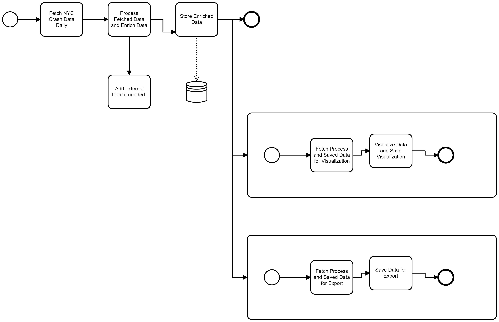

# nyc-crashes:
Helping the mayors office and other stakeholders to derive insights from Motor Vehicle Collisions/Crashes

## Objectives

To provide an interactive means for the mayors office and other stakeholders of New York City (NYC) to easily access motor vehicle collision information in an interactive manner thereby aiding them to make informed decisions.

## Stakeholders

**Primary Stakeholder**

* mayors office

**Secondary Stakeholders**
* police officers
* insurance companies
* medical facilities
* fire departments
* ordinary citizens
* roadusers/drivers
* NYC city council

## Possible Functionalities of System

* Easily query data about crushes with little to no technical knowlegde
* Easily create and share informative visualizations with people
* Access to basic informative visualizations that answer key questions
  * Visualize places where accidents happened for last several hours
  * Visualize nearest hospitals to the place of accident
  * etc.
* Provide predictive models that answer some questions:
  * Get information about what are the districts/crossroads where accidents occured most frequently for last week/month
  * Predict districts where an accident is more likely to occur today
  * Get information about how often does crashes take place on a specific street/crossroad
  * etc.
* Easily export data, visualizations or reports in some desired format.

## What we will build

Our system should make it easily for the mayors office to easily visualize number of crashes by time period and location. In addition we plan on showing the closest police station as well as closeset hospitals to crashes.

## Data Sources

* Primary data source:
  https://data.cityofnewyork.us/Public-Safety/Motor-Vehicle-Collisions-Crashes/h9gi-nx95
* Supporting Datasets:
  * Firehouse locations
  https://data.cityofnewyork.us/Public-Safety/FDNY-Firehouse-Listing/hc8x-tcnd
  * Neighbourhood Population
  https://data.cityofnewyork.us/City-Government/New-York-City-Population-By-Neighborhood-Tabulatio/swpk-hqdp
  * Realtime Traffic Data
  https://data.cityofnewyork.us/Transportation/Real-Time-Traffic-Speed-Data/qkm5-nuaq
  * Historical Traffic Data
  https://data.cityofnewyork.us/Transportation/Traffic-Volume-Counts-2012-2013-/p424-amsu
  * Parking Violations
  https://data.cityofnewyork.us/City-Government/Open-Parking-and-Camera-Violations/i4p3-pe6a
  * Metropolitan transportation data
  https://data.cityofnewyork.us/Transportation/MTA-Data/mmu8-8w8b
  * Emergency calls
  https://data.cityofnewyork.us/Public-Safety/911-End-to-End-Data/t7p9-n9dy
  * List of hospitals as of 2011
  https://data.cityofnewyork.us/Health/NYC-Health-Hospitals-Facilities-2011/ymhw-9cz9
  * List of police stations
  https://data.cityofnewyork.us/Public-Safety/Police-Precincts/78dh-3ptz

## Conceptual Modelling

BPMN Diagram:

//NB:
* We plan of fetching data daily, processing and saving in a cloud platform i.e Windows environment
* Data Harmonization will be done during data enrichment phase and saved to our chosen cloud platform. 
* Our chosen cloud platform will be azure.

## TODO:
* Schema Diagrams 

## Extra Reading

https://towardsdatascience.com/new-to-data-visualization-start-with-new-york-city-107785f836ab?gi=54183ba7443f

https://cawemo.com/diagrams/0b163bee-a87b-4d0e-a0e3-72af2b8c2ec3--etl-and-other-processes?v=960,378,1
